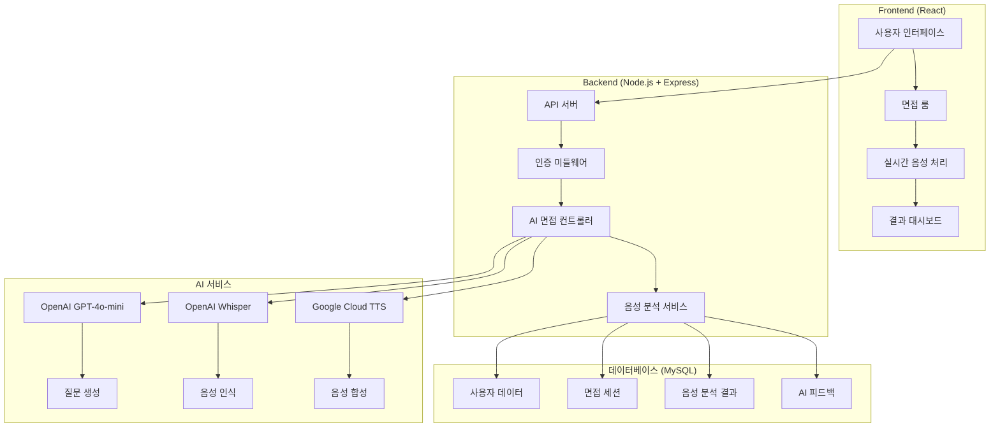
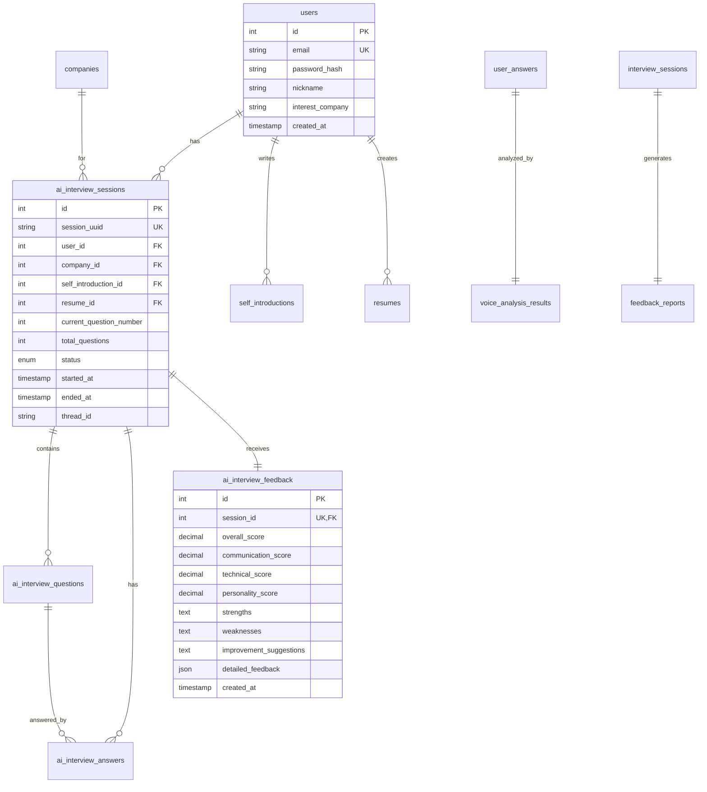

# 🎯 InnoView - AI 기반 맞춤형 면접 연습 플랫폼

<div align="center">


**AI 기술을 활용한 차세대 면접 연습 솔루션**

InnoView는 OpenAI GPT-4o-mini와 음성 인식 기술을 결합하여 개인화된 면접 질문을 생성하고, 실시간 음성 분석을 통해 상세한 피드백을 제공하는 혁신적인 면접 연습 플랫폼입니다.

</div>

---

## 📋 목차

- [🌟 주요 특징](#-주요-특징)
- [🏗️ 시스템 아키텍처](#️-시스템-아키텍처)
- [🛠️ 기술 스택](#️-기술-스택)
- [⚡ 핵심 기능](#-핵심-기능)
- [📊 데이터베이스 구조](#-데이터베이스-구조)
- [🚀 설치 및 실행](#-설치-및-실행)
- [🔧 환경 설정](#-환경-설정)
- [💡 사용 가이드](#-사용-가이드)
- [📄 라이선스](#-라이선스)

---

## 🌟 주요 특징

### 🤖 AI 기반 개인화된 면접

- **맞춤형 질문 생성**: 사용자의 이력서와 자기소개서를 분석하여 개인화된 면접 질문 자동 생성
- **동적 질문 조정**: 사용자 답변에 따른 실시간 심화 질문 및 꼬리 질문 생성
- **기업별 특화 면접**: 삼성전자, 카카오, 네이버, 배달의민족 등 기업별 맞춤 면접 시나리오

### 🎙️ 고급 음성 분석 시스템

- **실시간 STT**: OpenAI Whisper를 활용한 정확한 음성-텍스트 변환
- **TTS 음성 합성**: Google Cloud Text-to-Speech로 자연스러운 AI 면접관 음성
- **통합 음성 분석**: AssemblyAI + OpenAI 결합으로 발음, 속도, 감정, 내용 품질 종합 분석

### 📈 종합적인 피드백 시스템

- **다차원 평가**: 의사소통 능력, 전문 지식, 인성 및 태도 별도 점수화
- **AI 기반 피드백**: 강점, 약점, 구체적 개선 방안 자동 생성
- **진행률 추적**: 시간에 따른 면접 실력 향상 추이 분석

### 👤 사용자 중심 설계

- **직관적인 UI**: 현대적이고 사용하기 쉬운 React 기반 인터페이스
- **반응형 디자인**: 데스크톱, 태블릿, 모바일 모든 기기 최적화
- **다중 문서 관리**: 여러 개의 이력서와 자기소개서 작성 및 관리

---

## 🏗️ 시스템 아키텍처



---

## 🛠️ 기술 스택

### 🎨 Frontend

- **React 19.1.0**: 최신 React 기능 활용한 컴포넌트 기반 UI
- **React Router DOM 7.7.0**: 클라이언트 사이드 라우팅
- **Axios 1.11.0**: HTTP 클라이언트
- **Web Speech API**: 브라우저 네이티브 음성 인식 및 합성
- **React Markdown**: 마크다운 렌더링 (피드백 표시용)

### ⚙️ Backend

- **Node.js + Express.js**: 고성능 서버 프레임워크
- **MySQL2**: 데이터베이스 연결 및 쿼리 최적화
- **JWT**: 보안 토큰 기반 인증
- **bcrypt**: 비밀번호 암호화
- **multer**: 파일 업로드 처리
- **FFmpeg**: 오디오 파일 형식 변환

### 🤖 AI & 음성 처리

- **OpenAI GPT-4o-mini**: 면접 질문 생성 및 피드백
- **OpenAI Whisper**: 고정밀 음성 인식
- **Google Cloud Text-to-Speech**: 자연스러운 음성 합성
- **AssemblyAI**: 음성 품질 분석 (선택사항)

### 🗄️ 데이터베이스

- **MySQL 8.0+**: 관계형 데이터베이스
- **JSON 컬럼**: 유연한 분석 데이터 저장
- **인덱스 최적화**: 빠른 쿼리 성능

---

## ⚡ 핵심 기능

### 🎯 AI 면접 시스템

#### 5단계 질문 생성 프로세스

```javascript
// 작업 0: 자기소개 요청
POST /api/ai-interview/generate-question
{
  "task_type": "self_introduction_request",
  "company_id": "kakao",
  "self_introduction_id": 1,
  "resume_id": 1
}

// 작업 1: 초기 면접 질문 생성
{
  "task_type": "initial_question",
  "transcription": "안녕하세요. 저는..."
}

// 작업 2: 심화/꼬리 질문 생성
{
  "task_type": "follow_up_question",
  "question_text": "이전 질문",
  "transcription": "사용자 답변"
}

// 작업 3: 다음 기본 질문으로 전환
{
  "task_type": "next_question",
  "current_question_count": 3
}

// 작업 4: 면접 종료 조건 감지
// 자동으로 15개 질문 완료 시 종료
```

#### 실시간 음성 처리 워크플로우

```javascript
// 1. 음성 녹음 시작
startRecording() → MediaRecorder API

// 2. 음성 인식 (STT)
POST /api/ai-interview/transcribe
FormData: { audio: audioBlob }

// 3. AI 질문 생성
POST /api/ai-interview/generate-question
{ transcription: "사용자 답변" }

// 4. 음성 합성 (TTS)
Google Cloud TTS → MP3 오디오 생성

// 5. 다음 질문 재생
<audio src="ai_audio_url" />
```

### 📊 음성 분석 엔진

#### 통합 분석 시스템

```sql
-- voice_analysis_results 테이블
CREATE TABLE voice_analysis_results (
  id INT PRIMARY KEY,
  answer_id INT UNIQUE,
  pronunciation_score DECIMAL(5,2),    -- 발음 점수
  emotion VARCHAR(50),                 -- 감정 분석
  speed_wpm INT,                       -- 분당 단어 수
  filler_count INT,                    -- 필러 단어 개수
  pitch_variation DECIMAL(5,2),        -- 음성 변조
  confidence_score DECIMAL(5,2),       -- 신뢰도
  analysis_type ENUM('assemblyai', 'openai', 'combined'),
  raw_analysis_data JSON,              -- 상세 분석 데이터
  created_at TIMESTAMP
);
```

#### 분석 지표

- **발음 정확도**: 0-100점 스케일
- **감정 상태**: POSITIVE, NEUTRAL, NEGATIVE
- **말하기 속도**: 분당 단어 수 (WPM)
- **필러 단어**: "음", "어", "그" 등 불필요한 단어 개수
- **신뢰도**: AI 분석 결과의 확실성

---

## 📊 데이터베이스 구조

### 🗂️ 주요 테이블 관계도



---

## 🚀 설치 및 실행

### 📋 시스템 요구사항

- **Node.js**: 18.x 이상
- **MySQL**: 8.0 이상
- **FFmpeg**: 오디오 처리용
- **메모리**: 최소 4GB RAM
- **저장공간**: 최소 2GB (음성 파일 저장용)

### 🛠️ 설치 과정

#### 1. 프로젝트 클론

```bash
git clone https://github.com/your-username/InnoView.git
cd InnoView
```

#### 2. 의존성 설치

**서버 의존성 설치**

```bash
cd server
npm install

# 주요 의존성 확인
npm list --depth=0
# ├── express@4.18.2
# ├── mysql2@3.14.3
# ├── openai@4.104.0
# ├── @google-cloud/text-to-speech@6.2.0
# ├── fluent-ffmpeg@2.1.3
# └── bcrypt@6.0.0
```

**클라이언트 의존성 설치**

```bash
cd ../client
npm install

# 주요 의존성 확인
npm list --depth=0
# ├── react@19.1.0
# ├── react-dom@19.1.0
# ├── react-router-dom@7.7.0
# ├── axios@1.11.0
# └── react-markdown@10.1.0
```

#### 3. 서버 실행

**개발 모드**

```bash
# 서버 (포트 3001)
cd server
npm run dev

# 클라이언트 (포트 3000)
cd client
npm start
```

**프로덕션 모드**

```bash
# 클라이언트 빌드
cd client
npm run build

# 서버 실행
cd server
npm start
```

---

## 🔧 환경 설정

### 📄 환경 변수 파일 (.env)

**server/.env 파일 생성**

```bash
# 데이터베이스 설정
DB_HOST=localhost
DB_USER=innoview_user
DB_PASSWORD=your_database_password
DB_NAME=innoview

# JWT 인증
JWT_SECRET=your_super_secret_jwt_key_minimum_32_characters

# OpenAI API 설정
OPENAI_API_KEY=sk-your-openai-api-key-here

# 기업별 Assistant ID (OpenAI)
ASSISTANT_ID=asst_default_assistant_id
BAEMIN=asst_baemin_specific_id
COUPANG=asst_coupang_specific_id
NAVER=asst_naver_specific_id
KAKAO=asst_kakao_specific_id

# Google Cloud TTS (선택사항)
GOOGLE_APPLICATION_CREDENTIALS=path/to/google-credentials.json

# AssemblyAI (선택사항)
ASSEMBLY_API_KEY=your_assemblyai_key

# 서버 설정
NODE_ENV=development
PORT=3001

# 음성 분석 설정
MIN_TRANSCRIPT_LEN=100
```

### 🔑 API 키 획득 방법

#### OpenAI API 키

1. [OpenAI Platform](https://platform.openai.com) 접속
2. API Keys 메뉴에서 새 키 생성
3. Assistant 생성 후 Assistant ID 복사

#### Google Cloud TTS (선택사항)

1. [Google Cloud Console](https://console.cloud.google.com) 접속
2. Text-to-Speech API 활성화
3. 서비스 계정 생성 및 JSON 키 다운로드

#### AssemblyAI (선택사항)

1. [AssemblyAI](https://www.assemblyai.com) 가입
2. API 키 생성

---

## 💡 사용 가이드

### 🎯 AI 면접 진행 과정

#### 1단계: 면접 준비

```javascript
// 1. 로그인 후 대시보드 접속
// 2. 이력서/자기소개서 작성 (필수)
// 3. 관심 기업 선택 (선택사항)

// 이력서 작성 예시
const resumeData = {
  title: "프론트엔드 개발자 이력서",
  content: `
    ## 경력사항
    - ABC회사 프론트엔드 개발자 (2021-2024)
    - React, TypeScript, Node.js 전문
    
    ## 프로젝트
    - 전자상거래 플랫폼 개발
    - 사용자 경험 개선으로 전환율 15% 향상
    
    ## 기술스택
    - Frontend: React, Vue.js, TypeScript
    - Backend: Node.js, Express
    - Database: MySQL, MongoDB
  `,
};
```

#### 2단계: AI 면접 시작

```javascript
// AI 면접 선택 페이지에서 기업 선택
const interviewConfig = {
  company: "카카오",
  position: "프론트엔드 개발자",
  expectedDuration: "30분",
  questionCount: "최대 15개",
};

// 면접실 입장 → 자동으로 첫 번째 질문 생성
// "안녕하세요! 먼저 간단한 자기소개를 해주세요."
```

#### 3단계: 실시간 면접 진행

```javascript
// 음성 답변 프로세스
const interviewFlow = {
  1: "🎤 답변 시작 버튼 클릭",
  2: "🗣️ 음성으로 답변 (실시간 텍스트 변환)",
  3: "⏹️ 답변 완료 버튼 클릭",
  4: "🤖 AI가 답변 분석 및 다음 질문 생성",
  5: "🔊 AI 음성으로 다음 질문 재생",
  6: "🔄 15개 질문까지 반복",
};

// 질문 유형 예시
const questionTypes = {
  자기소개: "본인에 대해 간단히 소개해 주세요",
  경험질문: "가장 도전적인 프로젝트는 무엇이었나요?",
  기술질문: "React와 Vue.js의 차이점은 무엇인가요?",
  상황질문: "팀원과 의견 충돌이 있을 때 어떻게 해결하나요?",
  기업질문: "카카오에 지원한 이유는 무엇인가요?",
};
```

#### 4단계: 면접 결과 확인

```javascript
// 면접 완료 후 자동 피드백 생성
const feedbackStructure = {
  종합점수: "85/100점",
  세부평가: {
    의사소통: "88점 - 명확하고 논리적인 답변",
    전문지식: "82점 - 기술적 이해도 우수",
    인성태도: "85점 - 적극적이고 긍정적",
  },
  강점: [
    "구체적인 경험 사례 제시",
    "논리적인 문제 해결 접근",
    "적절한 말하기 속도",
  ],
  개선점: [
    "필러 단어 사용 줄이기",
    "더 구체적인 수치 제시",
    "감정 표현 다양화",
  ],
  제안사항: [
    "STAR 기법 활용 연습",
    "기업 연구 심화 학습",
    "모의 면접 지속 연습",
  ],
};
```

---

## 📞 지원 및 문의

### 🆘 도움이 필요하신가요?

- **📧 이메일**: heojunyeong1889@gmail.com

---
